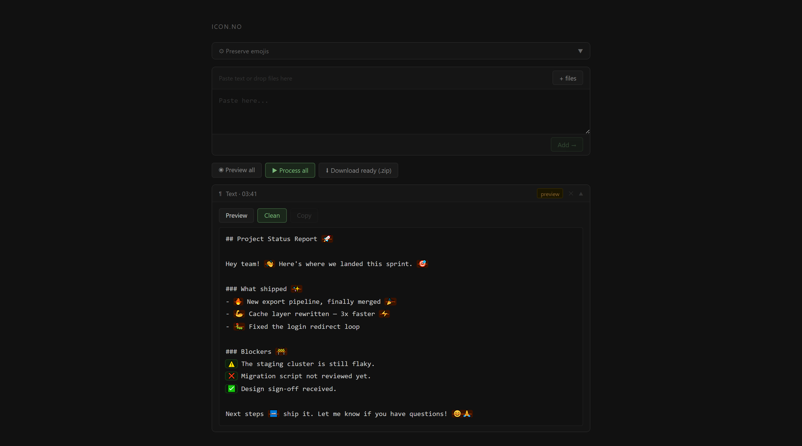

# icon.no

Removes decorative emojis from LLM output. Keeps the ones that mean something.

Paste text or drop files. Preview what gets removed. Download clean versions.

---

## How it works

Three files — no install, no server, no dependencies. Open `index.html` in a browser.

**Text** — paste, preview the diff, copy the clean result.

**Files** — drop one or more files, each gets its own preview/clean/download cycle. Bulk download as zip.

**Preserve lists** — toggle preset groups on/off, edit them, create your own. Changes take effect immediately and survive page reload.

---

## Presets (default)

| Name | Keeps |
|------|-------|
| Status | ✅ ❌ |
| Traffic light | 🟢 🔴 🟡 |
| Alerts | ℹ️ ⚠️ |
| Arrows | ➡️ ⬆️ ⬇️ ↩️ |

All presets are editable. Add emojis, remove them, create new ones, delete the defaults.

---

## Stack

Vanilla JS · CSS custom properties · `localStorage` · `Blob` API · inline zip writer

No build step. No CDN. Unicode 17.0 emoji ranges ported from [`icono.py`](.archive).

---

## License

GPL-3.0. See `LICENSE`.

## Credits

Developed by [@memoriainfinita](https://github.com/memoriainfinita) with the assistance of Claude (Anthropic).
